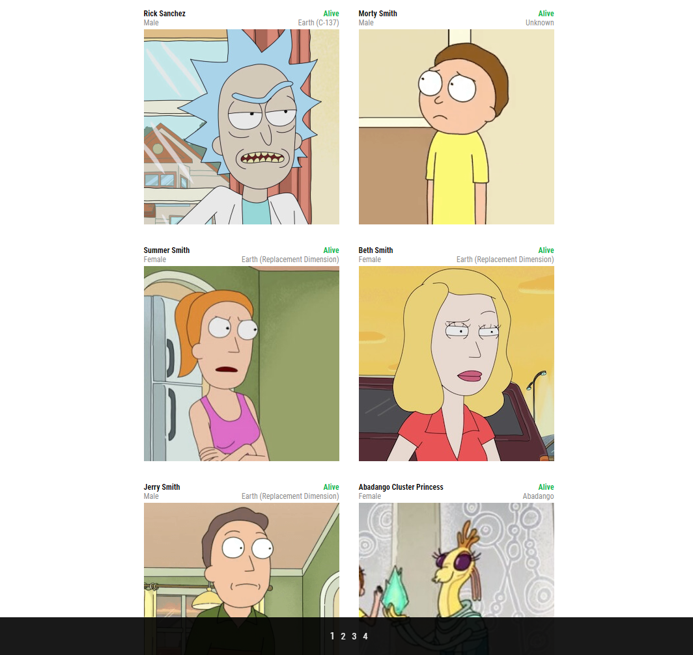

# Персонажи "Рик и Морти"

> Это приложение, в котором вы можете увидеть персонажей мультсериала "Рик и Морти". Карточки с персонажами разбиты по страницам.

  

## Built With

- HTML, SASS
- Vue 2
- Vuex

## Live Demo

- [Здесь вы можете посмотреть на "живую" версию приложения!](https://beautiful-belekoy-41885d.netlify.app)

## Getting Started

Чтобы скопировать проект на свой компьютер, нужны предустановленные:

- IDE (например, VSCode)
- Node.js

## Чтобы запустить проект на своём компьютере:

1. Нажмите на зелёную кнопку "Code" и выберите предпочитаемый способ клонирования проекта
2. Склонируйте проект на свой компьютер
3. Откройте папку с проектом в предпочитаемом редакторе (желательно VSCode)
4. Нажмите "View" и выберите "Terminal" в меню
5. Введите `npm i` в открывшемся терминале, чтобы установить все нужные для приложения зависимости
6. Введите `npm run serve` в терминале, чтобы запустить проект на своём локальном сервере

## Author

- GitHub: [@rdnrn](https://github.com/rdnrn)
- LinkedIn: [Nana Rodina](https://www.linkedin.com/in/arina-rodina-144612219/?locale=en_US)
- Twitter: [nana](https://twitter.com/rdnrn_nana)
